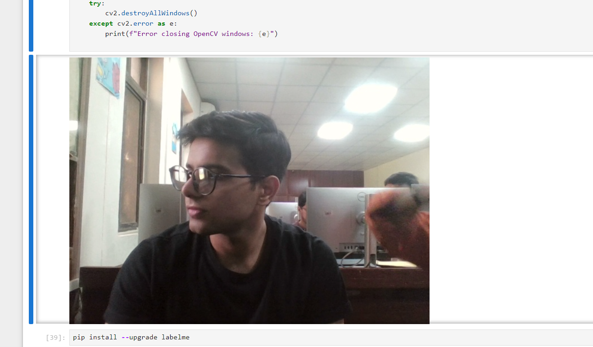
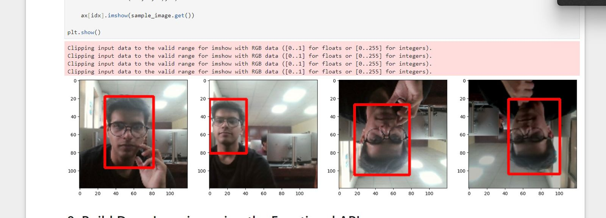
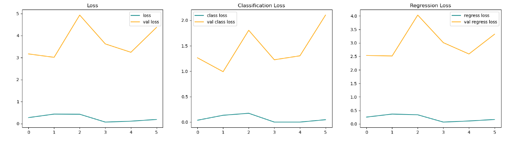

# SnapSense- Live Face Recognition

## Introduction 
In the realm of artificial intelligence and computer vision, the SnapSense project stands as a pioneering endeavor aiming to develop an advanced face recognition system. Utilizing Python and a meticulously curated dataset comprising our team's faces, SnapSense tackles the ever-present challenges of real-time dataset collection, model accuracy, and system customization. This project's architecture, spanning data collection, preprocessing, model design, training, evaluation, and deployment stages, embodies a comprehensive approach to face detection. By leveraging cutting-edge techniques and technologies, SnapSense heralds a new era in facial recognition technology, poised to revolutionize industries ranging from surveillance to biometrics and beyond.

 ### key points:
- The project aims to develop a live face recognition system using Python and TensorFlow, utilizing a self-created dataset of faces.
- Face detection is essential in various applications such as surveillance, biometrics, and emotion analysis.

## References

**Datasets:**
- Self-created dataset by capturing images of project members' faces.
- Publicly available model VGG-16 (CNN).

**A little about VGG-16**:   
The VGG-16 architecture consists of 16 layers, including 13 convolutional layers and 3 fully connected layers. Each convolutional block typically contains two or three 3x3 convolutional layers followed by a max-pooling layer. The fully connected layers serve as the classifier, with the final layer outputting probabilities for each class in the classification task. This simple yet deep architecture enables effective feature extraction and classification in image recognition tasks.


## Code and Results

**1. Data Preparation:**
- Captured images of project members' faces and manually annotated them using the LabelMe library, drawing bounding boxes around the faces.
  

- Initially, 180 images were annotated and saved in a folder called "labels."
- Created three folders for training, testing, and validation data and split the dataset with a 70-30 ratio, resulting in 125 images for training and 27 for testing.

```python
# Splitting data and transferring images and labels to respective folders
for folder in ['train','test','val']:
    for file in os.listdir(os.path.join('data', folder, 'images')):
        filename = file.split('.')[0]+'.json'
        existing_filepath = os.path.join('data','labels', filename)
        if os.path.exists(existing_filepath): 
            new_filepath = os.path.join('data',folder,'labels',filename)
            os.replace(existing_filepath, new_filepath)
```


**2. Data Augmentation:**
- Increased the dataset size by applying augmentation techniques like cropping and horizontal flip to the images.
- Augmentation helps in improving the model's robustness by providing variations in the training data.

```python
augmentor = alb.Compose([alb.RandomCrop(width=450, height=450), 
                         alb.HorizontalFlip(p=0.5), 
                         alb.RandomBrightnessContrast(p=0.2),
                         alb.RandomGamma(p=0.2), 
                         alb.RGBShift(p=0.2), 
                         alb.VerticalFlip(p=0.5)], 
                       bbox_params=alb.BboxParams(format='albumentations', 
                                                  label_fields=['class_labels']))
```
  

**3. Model Implementation:**
- Used VGG-16 CNN model pre-trained on ImageNet.
- Removed the 1st fully connected layer for compatibility with the custom dataset.
```python
vgg = VGG16(include_top=False)
```

**4. Model Architecture:**
-  Built a model architecture combining VGG-16 with separate branches for classification and bounding box regression. It utilizes global max pooling on VGG features, followed by fully connected layers for classification and regression tasks. Finally, it returns the combined model for face tracking.
  
```python
    input_layer = Input(shape=(120,120,3))
    vgg = VGG16(include_top=False)(input_layer)

    # Classification Model  
    f1 = GlobalMaxPooling2D()(vgg)
    class1 = Dense(2048, activation='relu')(f1)
    class2 = Dense(1, activation='sigmoid')(class1)
    
    # Bounding box model
    f2 = GlobalMaxPooling2D()(vgg)
    regress1 = Dense(2048, activation='relu')(f2)
    regress2 = Dense(4, activation='sigmoid')(regress1)
    
    facetracker = Model(inputs=input_layer, outputs=[class2, regress2])
    return facetracker
```


**5. Training Results:**
- Trained the model for 6 epochs with training and validation loss recorded.
- Fr the last epoch following values were recorded
```python
Epochs: 6
Total Loss: 0.5074
Classification Loss: 0.0795
Regression Loss: 0.4677
Validation Total Loss: 4.3729
Validation Classification Loss: 2.1030
Validation Regression Loss: 3.3214
```

**Insights from Loss Values Of all epochs:**

- The decreasing trend of total loss and its components (classification and regression loss) over epochs indicates that the model is learning and improving its performance.
- A low validation loss suggests that the model generalizes well to unseen data, indicating its effectiveness in real-world scenarios.
- Spikes or fluctuations in loss values may indicate issues such as overfitting or underfitting, which need to be addressed by adjusting model architecture or training parameters, which happened in previous training so we improved our dataset by making it more diverse and changing our epoch from 4 to 6.

  **Plotting:** 
  
  


  

**6. Model Saving and Loading:**
- Saved the trained model for later use.
```python
facetracker.save('facetracker.h5')
```
- Loaded the saved model using Keras library.
```python
facetracker = load_model('facetracker.h5')
```

**7. Live Testing:**
- Tested the model on live camera feed, producing accurate results.


## Future Scope:
- Further optimization of the model for improved accuracy.
- Integration of additional features like emotion recognition or age estimation.

# Conclusion
The SnapSense project aimed to develop a robust face detection system using Python and a customized dataset of our team's faces. Challenges included real-time dataset collection, ensuring high model accuracy, and crafting a bespoke face detection system. Our architecture comprised key stages: data collection, preprocessing, model design, training, evaluation, and deployment. By selecting and adapting the VGG-16 CNN model and employing rigorous training and augmentation techniques, we achieved promising results in accuracy and robustness. 

Overall, the project successfully demonstrates the capability to build a custom face detection system from scratch, showcasing expertise in artificial intelligence and computer vision.
# 
   **ENJOY ;)**
# 
